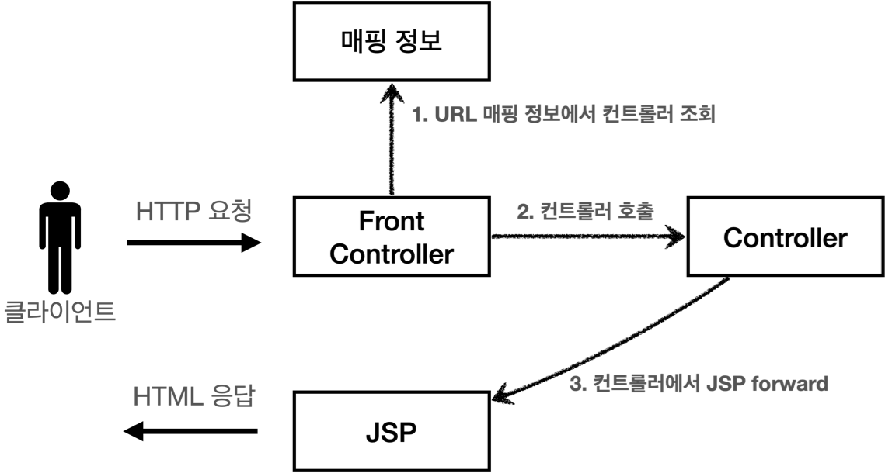
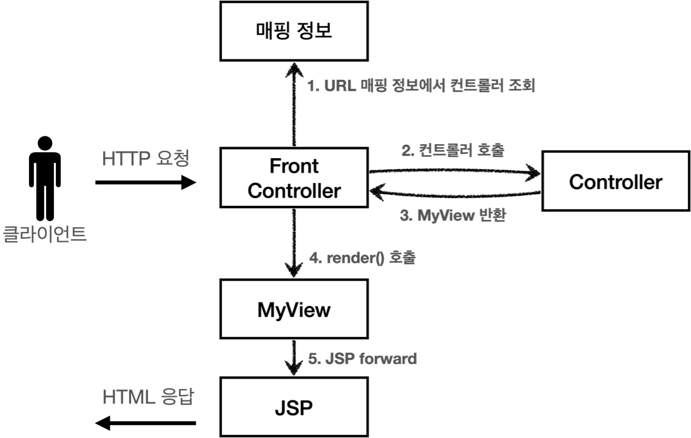
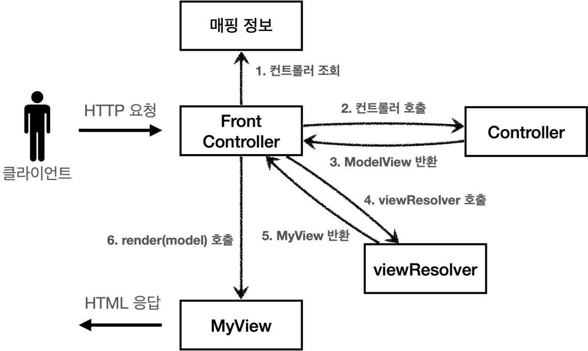

# 스프링 MVC 1편

## 🚀 서블릿, JSP, MVC 패턴
- 회원 관리 웹 애플리케이션 요구사항
  - 회원 정보
    1. 이름 : username
    2. 나이 : age
  - 기능 요구사항
    1. 회원 저장
    2. 회원 목록 조회

## V1

- ControllerV1
  - 서블릿과 비슷한 모양의 컨트롤러 인터페이스를 도입한다.
  - 각 컨트롤러들은 이 인터페이스를 구현하면 된다.
  - 프론트 컨트롤러는 이 인터페이스를 호출해서 구현과 관계없이 로직의 일관성을 가져갈 수 있다.
- Controller 구현체
  - MemberFormControllerV1 - 회원 등록 컨트롤러
  - MemberSaveControllerV1 - 회원 저장 컨트롤러
  - MemberListControllerV1 - 회원 목록 컨트롤러
- FrontControllerServletV1 - 프론트 컨트롤러
  - urlPatterns = "/front-controller/v1/*"
    - /front-controller/v1 을 포함한 하위 모든 요청을 이 서블릿에서 받아들인다.
    - controllerMap
      - key: 매핑 URL
      - value: 호출될 컨트롤러

## V2

- 모든 컨트롤러에서 뷰로 이동하는 부분에 중복이 있고, 깔끔하지 않다.
  - 이 부분을 깔끔하게 분리하기 위해 별도로 뷰를 처리하는 객체(MyView)를 만든다.
- 각 컨트롤러가 복잡한 dispatcher.forward()를 직접 생성해서 호출하지 않아도 된다.
  - 단순히 MyView 객체를 생성하고 거기에 뷰 이름만 넣고 반환하면 된다.
- 컨트롤러 interface의 반환 타입은 MyView이다.
  - 따라서 프론트 컨트롤러는 호출 결과로 MyView를 반환받는다.
    - 그리고 view.render()를 호출하면 forward 로직을 수행해서 JSP가 실행된다.

## V3

- ModelView
  - 서블릿의 종속성을 제거하기 위해 Model을 직접 만들고, 추가로 View 이름까지 전달하는 객체를 만든다.
- ControllerV3
  - 컨트롤러는 서블릿 기술을 전혀 사용하지 않는다.
  - HttpServletRequest가 제공하는 파라미터는 프론트 컨트롤러가 paramMap에 담아서 호출하게 해준다.
  - 응답 결과로 뷰 이름과 뷰에 전달할 Model 데이터를 포함하는 ModelView 객체를 반환하면 된다.
- Controller 구현체
  - ModelView를 생성할 때 view의 논리적인 이름을 지정한다.
  - 실제 물리적인 이름은 FrontController - viewResolver 메소드에서 처리한다.
- FrontControllerV3
  - viewResolver
    - 컨트롤러가 반환한 논리 뷰 이름을 실제 물리 뷰 경로로 변환한다.
  - createParamMap
    - HttpServletRequest에서 파라미터 정보를 꺼내서 Map으로 변환한다.
    - 그리고 해당 Map(paramMap)을 컨트롤러에 전달하면서 호출한다.
- MyView
  - model 객체를 전달받고, request 객체에 저장해둔다. (setAttribute)